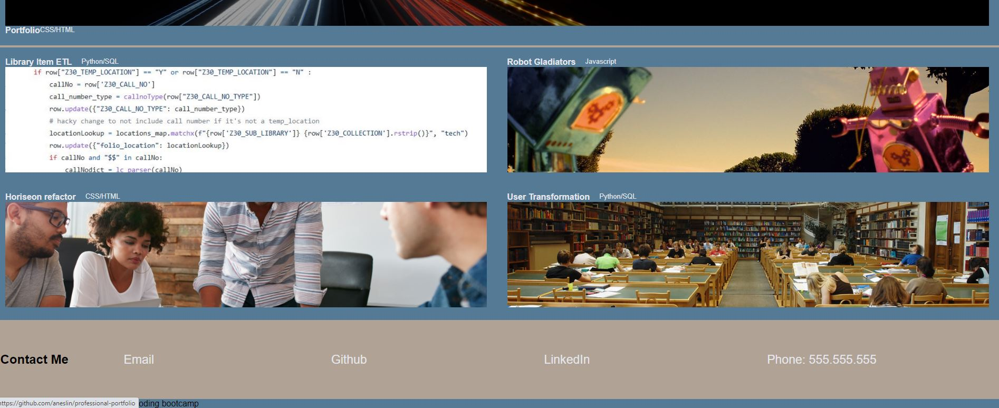

# Portfolio project

## Purpose
This is a project produced for week 2 of the UCONN full stack bootcamp. 

### Description
A portfolio for Aaron Neslin.  Includes links to 5 Github repoistories or github.io deployed websites.  CSS class applied to each object will make it easy to add addtional projects over time.  The page include links to github account and Linkedin, as well as placeholder personal contact information.  

#### Features
* A header with a nav bar that will take the user to any subsection
* An about me section with a recent picture
* Links to various projects I have worked on
* Clicking on a picture will take the user to the project
* The images darken on hover
* The page is responsive with media queries to adjust to a single column when the viewport is narrow
* The first project will always be the largest

## Link to Deployed Website 

[Deployed Portfolio Website]( https://aneslin.github.io/professional-portfolio/)

## Tools
This website is created entirely with HTML and CSS

## Acknowledgments
Images are used under CC attribution license. Attribution is included in comments